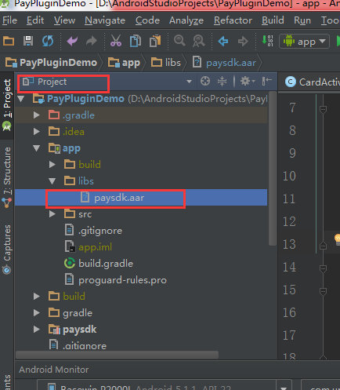
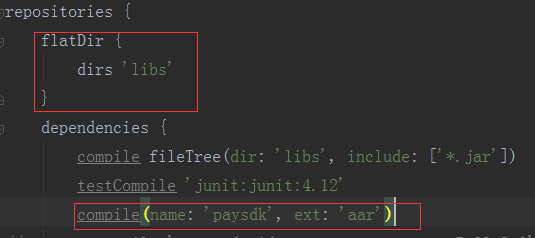

##### 1．拷贝`aar`文件
把我们提供的`paysdk.aar`文件拷贝到`app`目录的`libs`文件夹下面，如下图：




##### 2.修改`build.gradle`

修改app下面的build.gradle中根目录添加

```java
repositories {
    flatDir {
        dirs 'libs'
    }
}

```

`dependencies`中添加`compile(name: 'paysdk', ext: 'aar')`如下图：



##### 3.添加解析`json`依赖包

`dependencies`中添加`compile 'com.alibaba:fastjson:1.2.48'`

**注意： 如果项目当中有这个包可以忽略此步。**


##### 4.同步gradle
最后一步同步`gradle`，同步完成之后，在类中写入`UMFintech.getInstance()`不报错就代表集成成功。


##### 混淆配置

```java
-keep class com.umfintech.paysdk.** { *;}
```
